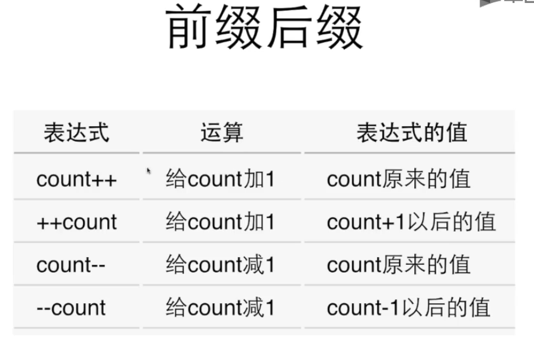

## 1.变量
- 变量定义<变量类型> <变量名>;
- 标识符只能由字母、数字、下划线构成，不能以数字开头
- 当赋值发生在变量定义时(int a=0)，就是变量的初始化，<变量类型> <变量名> = <初始值>
- scanf("%d",&) f表示formated，"%d"表示格式字符串
- 固定不变的数是常数。直接写在程序里称作直接量(literal)
- 常量 const int AMOUNT
- 一个scanf("%d %d")可以接收多个变量
- 数据类型
    - int printf("%d") scanf("%d")
    - double printf("%f") scanf("%lf") 
## 2.表达式
- 运算符优先级

> Note：
> 1. C语言中=是赋值运算符，其他语言中赋值可能为语句
> 2. 单目运算符和赋值运算符都是自右向左
- 算数运算符与赋值运算符结合起来，形成赋值符合运算符，如`sum *=a+3`，表示`sum=sum*(a+3)`
- 递增、递减运算符为单目运算符，算子必须是变量，如a++，而不是5++

