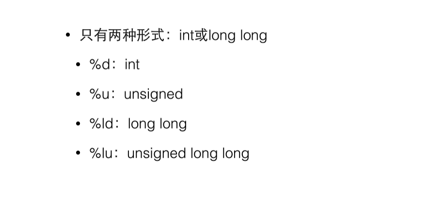
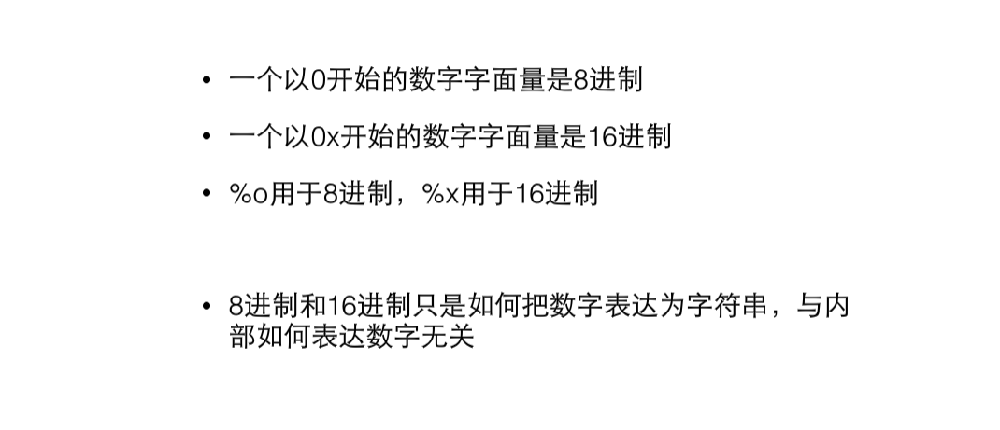

## 1.C语言的类型
- 整数、浮点数、逻辑、指针、自定义类型


## 2.sizeof
- 给出某个类型或变量在内存中的字节数
- 是静态运算符，他的结果在编译时就已经决定了
- 不要在括号里做运算，不会执行
```c
int a = 3;
sizeof(a++); //4
printf("%d",a); //a=3
```

## 3.补码
- 补码的意义就是拿补码和原码加出一个溢出的零
```c
1   => 00000001
-1  => 11111111           11111111 + 00000001 => （1）00000000
-a = 0-a
```

## 4.unsigned
- 在整型类型前面上加上unsigned使得他们成为无符号的整数
- 内部的二进制表达没变，变得只是如何看待他们
- 11111111 对于char 表示-1，最前面的1表示补码；对于unsigned char表示255 
- unsigned的初衷并非扩展数能表达的范围，而是为了做纯二进制运算，主要为了移位

## 5.整数越界
- 0,1....255=>0  unsigned
- -128,-127...0,1...127=>-128
## 6.整数的输入输出

## 7. 进制

## 8.如何选择整数类型

## 9.浮点类型
类型|字长|有效数字|scanf|ptintf
--|--|--|--|--
float|32|7|%f|%f,%e(科学计数法)
double|64|15|%lf|%f,%e
- inf 正无穷大；-inf 负无穷大；nan 非数字
> 注意：带小数点的字面量是double而非float,float需要用f或F后缀来表明身份；浮点运算的精度问题
```c
float a,b,c;
a=1.123f;
b=1.345f;
c=a+b;
printf("%d",c==2.468);//0,不相等
```
> 在计算机内部，整型通过二进制存储；浮点型通过一种编码形式存储
> 选择浮点类型：没有特殊需要，只是用double;现代CPU能直接对double做硬件运算，性能不会比float差，在64位机器上，数据存储的速度也不比float慢
## 10.字符类型
- char是一种整数，也是一种特殊的类型：字符
- printf,scanf用%c来输入输出字符
## 11.逃逸字符
- \
## 12.自动类型转换
- 当运算符的两边出现不一致的类型时，会自动转换成较大的类型，大的意思是表达的数的范围更大
- char -> short -> int -> long long
- int -> float -> double
- 对于printf,任何小于int的类型会被转换成int,float转换成double
- 强制类型转换注意数的范围，(short)32768 = -32768,short最大范围到32767
## 13.逻辑类型
- bool，非原生类型，C99后正式引入，需要先引入头文件<stdbool.h>,之后就可以使用true,false
## 14.逻辑运算
- ！ && ||
- 优先级 ！> && > ||
## 15.条件运算
- ? : 优先级略高于赋值运算符
## 16.逗号运算
- 优先级最低，主要在for中使用
```c
for(i=0,j=1;i<10;i++,j-->)
```

