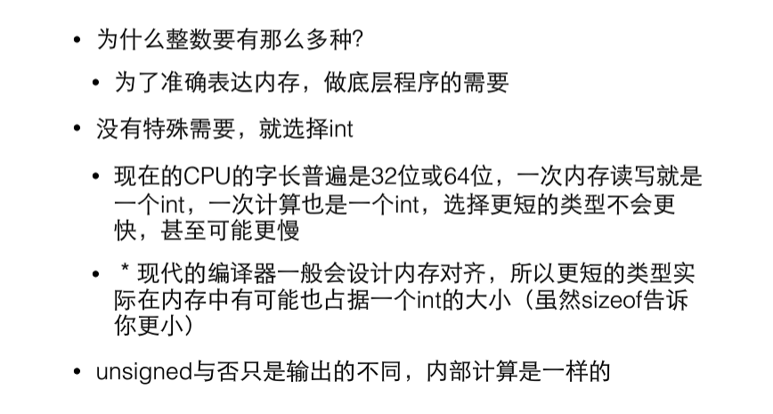

## 1.C语言的类型
- 整数、浮点数、逻辑、指针、自定义类型


## 2.sizeof
- 给出某个类型或变量在内存中的字节数
- 是静态运算符，他的结果在编译时就已经决定了
- 不要在括号里做运算，不会执行
```c
int a = 3;
sizeof(a++); //4
printf("%d",a); //a=3
```

## 3.补码
- 补码的意义就是拿补码和原码加出一个溢出的零
```c
1   => 00000001
-1  => 11111111           11111111 + 00000001 => （1）00000000
-a = 0-a
```

## 4.unsigned
- 在整型类型前面上加上unsigned使得他们成为无符号的整数
- 内部的二进制表达没变，变得只是如何看待他们
- 11111111 对于char 表示-1，最前面的1表示补码；对于unsigned char表示255 
- unsigned的初衷并非扩展数能表达的范围，而是为了做纯二进制运算，主要为了移位

## 5.整数越界
- 0,1....255=>0  unsigned
- -128,-127...0,1...127=>-128
## 6.整数的输入输出

## 7. 进制

## 8.如何选择整数类型

## 9.浮点类型
类型|字长|有效数字|scanf|ptintf
--|--|--|--|--
float|32|7|%f|%f,%e(科学计数法)
double|64|15|%lf|%f,%e
